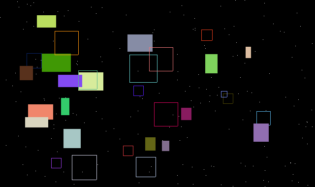
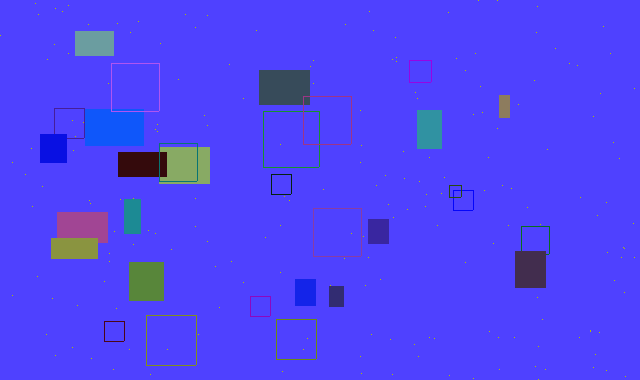

# canvas-drawer

Implements a simple drawing api

## How to build

*Windows*

Open git bash to the directory containing this repository.

```
canvas-drawer $ mkdir build
canvas-drawer $ cd build
canvas-drawer/build $ cmake -G "Visual Studio 16 2019" ..
canvas-drawer/build $ start Draw-2D.sln
```

Your solution file should contain two projects: `pixmap_art` and `pixmap_test`.
To run from the git bash command shell, 

```
canvas-drawer/build $ ../bin/Debug/draw_test
canvas-drawer/build $ ../bin/Debug/draw_art
```

*macOS*

Open terminal to the directory containing this repository.

```
canvas-drawer $ mkdir build
canvas-drawer $ cd build
canvas-drawer/build $ cmake ..
canvas-drawer/build $ make
```

To run each program from build, you would type

```
canvas-drawer/build $ ../bin/draw_test
canvas-drawer/build $ ../bin/draw_art
```

## Supported primitives

My class supports points, lines, triangles and rectangles. 
The primitives that can be filled have the option to be filled
or outlined, and the images have the capacity for difference blending 
with a color of the user's choice.

## Results

By plotting random white points on a black background,
then placing randomly generated rectangles with random colors
and random filling and outlining, I created a new take on existence
in the universe: Rectangles in Space.



To create this next piece, I added difference blending with a random 
shade of blue (r and g are random, b = 255).

